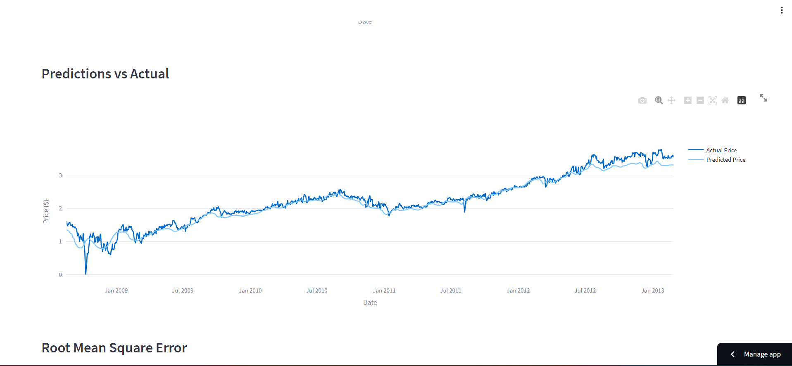

# Predictstock: Stock Price Prediction and Visualization

### [Visit the Hosted Site](https://predictstock.streamlit.app)

## Overview

Predictstock is a Python-based web application that leverages machine learning, data analysis, and interactive visualization to predict and analyze stock prices. With Predictstock, you can gain valuable insights into historical stock price trends and make informed decisions for your investment strategies.

## Features

* Historical Data Analysis: Explore historical stock price data for the past 15 years, including summary statistics.

* Interactive Candlestick Charts: Visualize stock price movements over time using interactive candlestick charts.

* Moving Averages: Overlay moving average lines (e.g., 100-day and 200-day) on price charts for technical analysis.

* Machine Learning Model: Utilize a pre-trained machine learning model to predict future stock prices.

* Accuracy Assessment: Evaluate the accuracy of the model's predictions using metrics like Root Mean Square Error (RMSE) and median accuracy.

# Installation

To run Predictstock locally, follow these steps:

- Clone this repository to your local machine.

    git clone https://github.com/yourusername/predictstock.git

- Install the required Python libraries using pip.

    pip install -r requirements.txt

- Run the Streamlit app.

    streamlit run predictstock.py

- Open a web browser and access the app at `https://localhost :8501`

# Usage

1. Enter the stock ticker symbol (e.g., GOOG) in the input field to retrieve historical data.

2. Explore the historical data, including summary statistics.

3. View candlestick charts with or without moving averages.

4. Analyze predictions vs. actual stock prices to assess model accuracy.

5. Adjust the date range or parameters as needed to refine your analysis.

# Contributing

Contributions are welcome! If you'd like to enhance Predictstock or fix any issues, please fork the repository and submit your pull requests.

# License

This project is licensed under the MIT License - see the [LICENSE](LICENSE) file for details.

